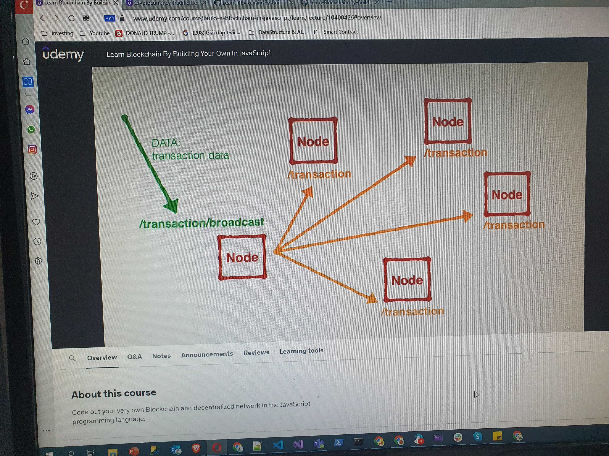

# Section 2: Building a Blockchain
## Run test
```sh
 $ node dev/test.js
```

One block has:
- index (block number)
- timestamp
- pending transactions (wait for verify). It will be pushed into next new block
- nonce (proof)
- hash
- previous block's hash

Genesic block does not have hash and previous block's hash

Using sha256 to generate block's hash

Proof of Work:
 1. Repeat hash block until it finds correct hash => '0000WRKWER9803KJLJBA'
 2. Use previousBlockHash, currentBlockData and nonce for generate hash
 3. Continue changes nonce until it finds correct hash
 4. Return nonce value that creates the correct hash

---

# Section 3: Accessing the Blockchain through an API
## Install Express

```sh
npm i express
```
## Run test
```sh
 $ node dev/api.js

 http://localhost:3000/
```

## Install Nodemon
> nodemon is a tool that helps develop Node.js based applications by automatically restarting the node application when file changes in the directory are detected.

```sh
npm i express
```

> "start": "nodemon --watch dev -e js dev/api.js"

- **watch** any file changes in ***dev*** folder
- **e** keep an eyes file is javascript (.js) 
- automatically restarting ***dev/api.js*** file

```sh
npm start
```
## Install body-parser
> Node.js body parsing middleware.

> Parse incoming request bodies in a middleware before your handlers, available under the ***req.body*** property.

```sh
npm i body-parser
```

APIs

1. **GET/ blockchain**: get entire blockchain
2. **POST/ transaction**: receive new transaction information and add to pendingTransactions array
3. **GET/ mine**: mining a new block

Test

1. Run web to mine new block: http://localhost:3000/mine
2. Run http://localhost:3000/blockchain to check add new block into blockchain
3. Run postman **POST/ transaction** add some new pending transasction
4. Run /blockchain to see new pending transaction
5. Run mine to see new pending transaction is pushed into new block

Summary

1. Create some new transaction -> add into pending transaction
2. Mine new block -> some pending transaction will be pushed into new block
3. Check entire blockchain -> new block will be pushed into chain and pendingTransaction array is empty

---

# Section 4: Create a Decentralized Blockchain network

## change scripts run in package.json

```sh
"scripts": {
    "test": "echo \"Error: no test specified\" && exit 1",
    "node_1": "nodemon --watch dev -e js dev/networkNode.js 3001 http://localhost:3001/transaction",
    "node_2": "nodemon --watch dev -e js dev/networkNode.js 3002 http://localhost:3002/transaction",
    "node_3": "nodemon --watch dev -e js dev/networkNode.js 3003 http://localhost:3003/transaction",
    "node_4": "nodemon --watch dev -e js dev/networkNode.js 3004 http://localhost:3004/transaction",
    "node_5": "nodemon --watch dev -e js dev/networkNode.js 3005 http://localhost:3005/transaction"
  },
```

Get argument port in javascript at index 2

> const port = process.argv[2]

Run in multi cmd windows

> npm run node_1

> npm run node_2

Create new pending transaction at Postman in node 1 (http://localhost:3001/transaction), node 3 (http://localhost:3003/transaction)

> These transactions is in private node, must decentralized by every node aware all transaction of all node

## Register and broadcast node


## Install request
> The simplified HTTP request client 'request' with Promise support. Powered by Bluebird.

```sh
npm install request --save
```

## Summary

Existing node: `Node 1`, `Node 2`, `Node 4`

New Node: `Node 3`

1. `Node 1` calls `register-and-broadcast-node` for new `Node 3` (`Node 1` has awared about new `Node 3`)
2. `Node 2` and `Node 4` calls `register-node` for awaring about new `Node 3`
3. After all, `Node 3` calls `register-nodes-bulk` for awaring all existing nodes in network

> All request options and uri is built in `Node 1`

---

# Section 5: Synchronizing the Network

All existing nodes need to aware new pending transaction and new mine block



 - Aware new pending transaction

 1. Current node add new transaction into pending transaction array
 2. Then current node will broadcast new transaction to all existing nodes in network
 3. All existing nodes will call `/transaction` POST to add new transation into pending transaction array
 4. All nodes have same new pending transaction datas.

 - Aware new block is mined

 1. Node will create new block if it finds correct hash (proof of Work)
 2. Then node will request to all network nodes for receiving new block
 3. All existing nodes will call `/receive-new-block` to push new block into `this.chain`
 4. Then node winner will call `/transaction/broadcast` to broadcast for all network nodes about mining reward transaction to current node Address.
 But this transaction is into pending transaction array (memory pool)
 5. This transaction will be added `transactions` array into new another block


